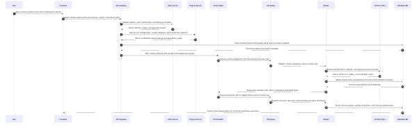
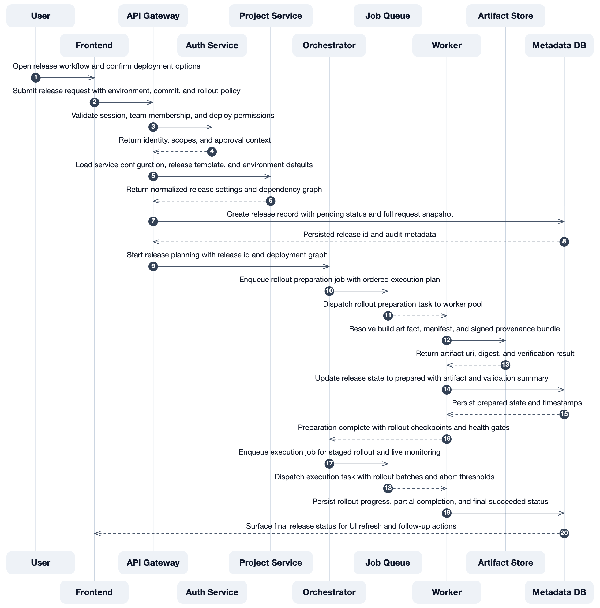
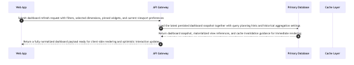
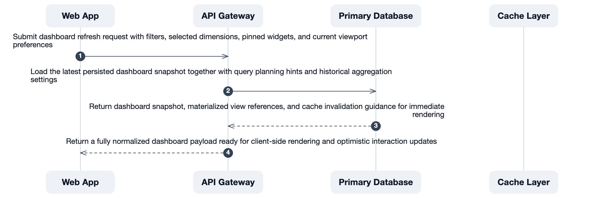

# readable-mermaid

Local-first custom renderer for Mermaid `sequenceDiagram`, optimized for readable technical design screenshots.

## How To Run

```bash
npm install
node ./src/cli.js ./samples/run-job-sequence.mmd
```

The CLI writes outputs to `./dist/` under your current working directory.

If you want the command on your path:

```bash
npm link
readable-mermaid ./samples/run-job-sequence.mmd
```

## Why

Mermaid's default output works fine for simple diagrams (≤4 participants, short labels). But once you hit 6+ participants with realistic message labels — which is normal for any real technical design document — text becomes too small to read without zooming and scrolling. AI tools make this worse by generating complete, detailed diagrams that are technically correct but practically unreadable.

`readable-mermaid` narrows the scope on purpose:

- support only Mermaid `sequenceDiagram`
- support a documented `sequenceDiagram` syntax subset instead of all Mermaid features
- export one doc-ready `SVG` and one `PNG`
- run fully locally
- avoid uploads or remote services

If you need other Mermaid diagram types, contributions are welcome, but this project is intentionally focused on sequence diagrams first.

## Comparison

10 participants / 20 messages:

| Mermaid native | readable-mermaid |
| --- | --- |
|  |  |

4 participants / long message labels:

| Mermaid native | readable-mermaid |
| --- | --- |
|  |  |

## What It Outputs

Given one `.mmd` file inside the current working directory, the CLI exports:

- `dist/<name>.screen-readable.svg`
- `dist/<name>.screen-readable.png`

## Scope

- only Mermaid `sequenceDiagram`
- custom renderer for a supported Mermaid syntax subset
- tuned for laptop-screen readability rather than strict document-column width
- sequence-specific layout heuristics for participants, messages, notes, blocks, and long labels

Supported syntax today:

- `autonumber`
- `participant` / `actor`
- messages with `->>`, `-->>`, `->`, `-->`, `-)`, `--)`
- `Note over`
- `alt` / `else`
- `par` / `and`
- `opt`
- `loop`
- `activate` / `deactivate`

Unsupported sequence syntax fails fast with a non-zero exit code instead of being silently ignored.

## Local Browser Requirement

This project expects one of these app binaries to exist:

- `/Applications/Google Chrome.app/Contents/MacOS/Google Chrome`
- `/Applications/Chromium.app/Contents/MacOS/Chromium`
- `/Applications/Microsoft Edge.app/Contents/MacOS/Microsoft Edge`

## Security Posture

- input stays on the local machine
- the CLI only reads inputs inside the current working directory
- the CLI only writes outputs inside `./dist/` under the current working directory
- rendering happens through a local browser process
- external `http:` and `https:` requests are blocked during render
- no SaaS backend, upload step, or remote API call in the render path

## Exit Codes

- `2`: invalid CLI usage
- `3`: input or output path is outside the current working directory
- `4`: unsupported diagram type
- `5`: unsupported Mermaid sequence syntax
- `6`: supported local browser binary not found
- `7`: render failed

## Release Metadata

Use `npm run release:artifacts` to generate a local release bundle with a package tarball, CycloneDX SBOM, license inventory, manifest, and `SHA256SUMS`.

Use `npm run test:regression` to compare generated sample SVG outputs against the committed baselines, and `npm run test:sample` to smoke-test the full `SVG + PNG` CLI path.

## Test Samples

The repo includes targeted sequence-diagram samples for:

- low participant count
- high participant count up to 10 lanes
- long labels
- long notes
- self-loops on edge lanes
- short-span long text
- wide-span branching
- right-heavy return flows
- dense four-lane sequences
- `loop`, `opt`, `activate`, and `deactivate`

## Known Limits

- the renderer is intentionally narrow and currently supports only sequence diagrams
- the renderer only supports the documented Mermaid sequence syntax subset
- very wide or very dense sequences may still need more layout tuning
- the renderer does not yet split oversized diagrams into multiple panels
